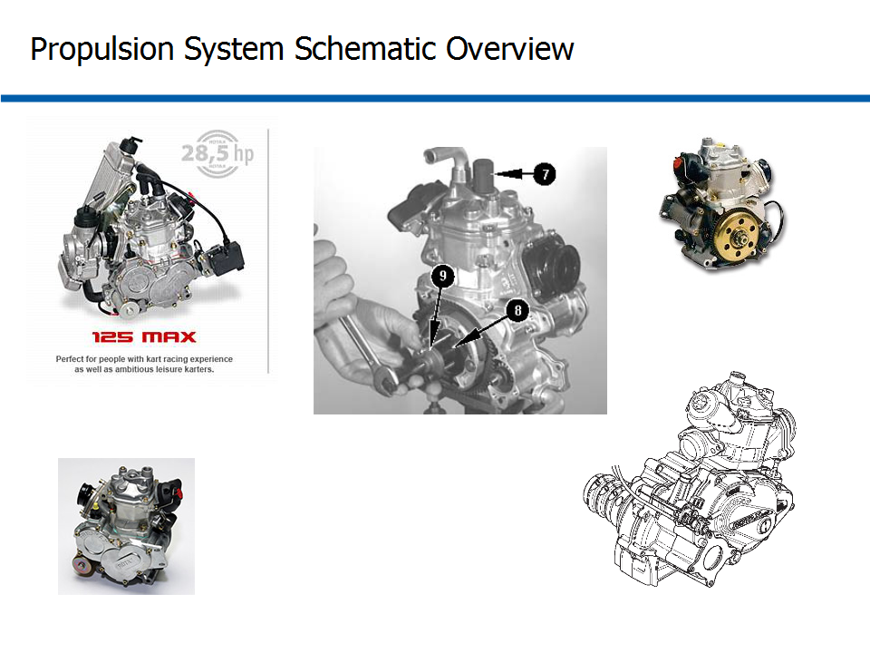
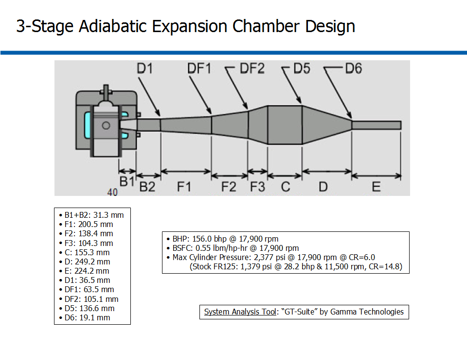

# ========================================
# Air Vehicle Hybrid Turboprop Two-Stroke ICE Based 70kft Altitude UAV Operation Optimization:
# ========================================

## I. Design Context Overview:

## 
## 
## II. Overview of Hybrid Turboprop Configuration:

## 
## 
## III. Overview of Integrated Propulsion/Thermal System Schematic:

## 
## 
## IV. Overview of Wing Vapor-Cycle Thermal Control:

## 
## 
## V. Overview of Wing Water Vapor-Cycle Thermal Control Schematic:

## 
## 
## VI. Thermal Load Breakdown for Configuration 002A (79.1 kW):

## 
## 
## VII. Thermal Load Breakdown for Configuration 002B (52.9 kW):

## 
## 
## VIII. Overview of IC Engine Sub-System:

## 
## 
## IX. Modified COTS 2-Stroke ICE:

## 
## 
## X. Overview of ICE Sub-System Performance:

## 
## 
## XI. Summary of Overall BHP vs. RPM w/o Combustors for Different Intake Boost Levels:

## 
## 
## XII. Summary of Overall BHP vs. RPM w/ Combustors for Different Intake Boost Levels:

## 
## 
## XIII. Summary of Overall BSFC vs. RPM w/o Combustors for Different Intake Boost Levels:

## 
## 
## XIV. Summary of Overall BSFC vs. RPM w/ Combustors for Different Intake Boost Levels:

## 
## 
## XV. Summary of Max Cylinder Pressure vs. RPM for Different Intake Boost Levels:

## 
## 
## XVI. Summary of Exhaust-to-Intake Pressure Ratio vs. RPM for Different Intake Boost Levels:

## 
## 
## XVII. Summary of BHP vs. RPM for Different Exhaust System Designs:

## 
## 
## XVIII. Summary of BSFC vs. RPM for Different Exhaust System Designs:

## 
## 
## XIX. Summary of Exhaust Outlet Total-Temperature vs. RPM for Different Exhaust System Designs:

## 
## 
## XX. Summary of Exhaust Outlet Total-Pressure vs. RPM for Different Exhaust System Designs:

## 
## 
## XXI. Summary of Exhaust Mass-Flow-Rate vs. RPM for Different Exhaust System Designs:

## 
## 
## XXII. Summary of Exhaust Turbine Power vs. RPM for Different Exhaust System Designs:

## 
## 
## XXIII. Summary of Choked/Adiabatic 3-Stage Expansion Chamber Design:

## 
## *Notes: 
## 1. Turbomachinery Performance Data and Analysis performed using AxStream, SoftInWay Inc.
## 2. ICE Performance Data and Analysis performed using "GT-Suite", Gamma Technologies Inc.
